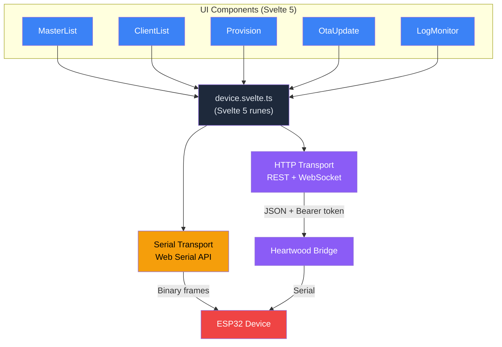
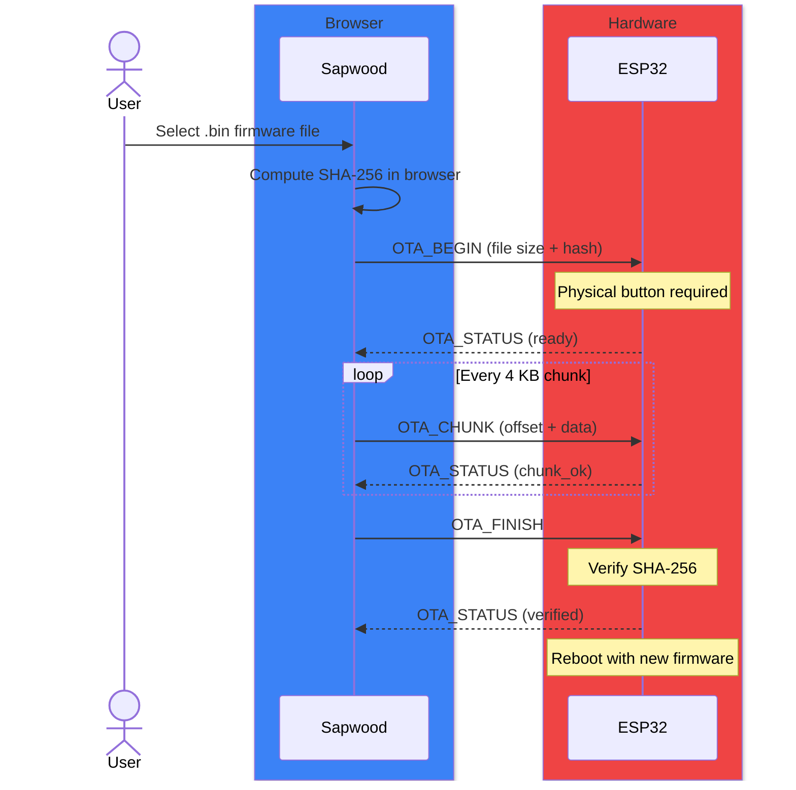

# Sapwood Architecture

> **This component is part of the [ForgeSworn Identity Stack](https://github.com/forgesworn/heartwood/blob/main/docs/ECOSYSTEM.md).** See the ecosystem overview for how it connects to the other components.

Sapwood is a browser-based management UI for Heartwood signing devices. It provisions master identities, manages client policies, uploads firmware, and monitors logs. Connects via Web Serial (direct USB) or HTTP (bridge on the Pi). 21 KB gzipped, zero server-side dependencies.

## Dual transport abstraction

UI components don't know which transport is active. Both emit the same `Frame` events into a shared reactive state store.



**Serial transport** talks directly to the ESP32's USB-Serial-JTAG interface (VID: 0x303a, PID: 0x1001) at 115,200 baud. It hunts for magic bytes `0x48 0x57` to separate binary protocol frames from ESP-IDF log output.

**HTTP transport** talks to the Heartwood bridge running on the Pi. REST API for commands, WebSocket for log streaming. Bearer token auth (injected by bridge). HTTP responses are wrapped as synthetic `Frame` objects so the state store processes them identically.

## Frame protocol

TypeScript port of `heartwood-common/src/frame.rs`. 19 tests verify byte-level compatibility.

Wire format:

```
[0x48 0x57] [type: u8] [length: u16 BE] [payload: 0..32768] [crc32: u32 BE]
```

| Frame | Code | Direction | Payload |
|-------|------|-----------|---------|
| PROVISION_LIST | 0x05 | host to device | (empty) |
| PROVISION_LIST_RESPONSE | 0x07 | device to host | JSON: master slots |
| ACK | 0x06 | device to host | (empty) |
| NACK | 0x15 | device to host | (empty) |
| FACTORY_RESET | 0x24 | host to device | (empty, button required) |
| POLICY_LIST_REQUEST | 0x27 | host to device | master_slot (1 byte) |
| POLICY_LIST_RESPONSE | 0x28 | device to host | JSON: client policies |
| POLICY_REVOKE | 0x29 | host to device | master_slot + pubkey_hex |
| POLICY_UPDATE | 0x2A | host to device | master_slot + JSON policy |
| OTA_BEGIN | 0x30 | host to device | size (u32 BE) + SHA-256 hash (button required) |
| OTA_CHUNK | 0x31 | host to device | offset (u32 BE) + binary data |
| OTA_FINISH | 0x32 | host to device | (empty) |
| OTA_STATUS | 0x33 | device to host | status byte |
| CONNSLOT_LIST_RESP | 0x43 | device to host | JSON: connection slots |

CRC32 uses IEEE 802.3 polynomial, covering type + length + payload (not magic bytes).

## OTA firmware update

Firmware updates run over USB with SHA-256 verification and physical button confirmation.



Over HTTP, OTA uses a single streaming `POST /api/device/ota` instead of the frame-by-frame protocol. The bridge handles chunking and verification internally.

## Provisioning

Three modes for establishing a master identity on the device:

| Mode | Input | Derivation | Secret sent |
|------|-------|------------|-------------|
| **Tree (mnemonic)** | 12/24-word BIP-39 | BIP-32 at `m/44'/1237'/727'/0'/0'` | 32-byte derived root |
| **Tree (nsec)** | Existing nsec | HMAC-SHA256(nsec, "nsec-tree-root") | 32-byte derived root |
| **Bunker** | Existing nsec | None (raw) | 32-byte nsec |

Secrets are zeroised in browser memory immediately after transmission.

## Security model

**What leaves the device:** public keys, policy metadata, signatures, log output.

**What stays on the device:** master secrets, derived private keys, PIN, bridge secret.

**Physical button required for:** provisioning, factory reset, OTA begin, bridge secret change.

A compromised Sapwood SPA cannot extract keys, sign arbitrary events, trigger factory reset, or upload firmware. The attack surface is local only -- an attacker must have physical access to press the button.

## Integration points

- **[Heartwood](https://github.com/forgesworn/heartwood):** The device Sapwood manages. Sapwood provisions master identities and manages client policies on the ESP32 running Heartwood firmware.
- **[nsec-tree](https://github.com/forgesworn/nsec-tree):** Sapwood uses the same derivation scheme for provisioning (mnemonic and nsec modes). The TypeScript nsec-tree library computes the derived root in-browser before sending to the device.
- **[ForgeSworn Identity Stack](https://github.com/forgesworn/heartwood/blob/main/docs/ECOSYSTEM.md):** Sapwood is the device management layer of the signing stack.
